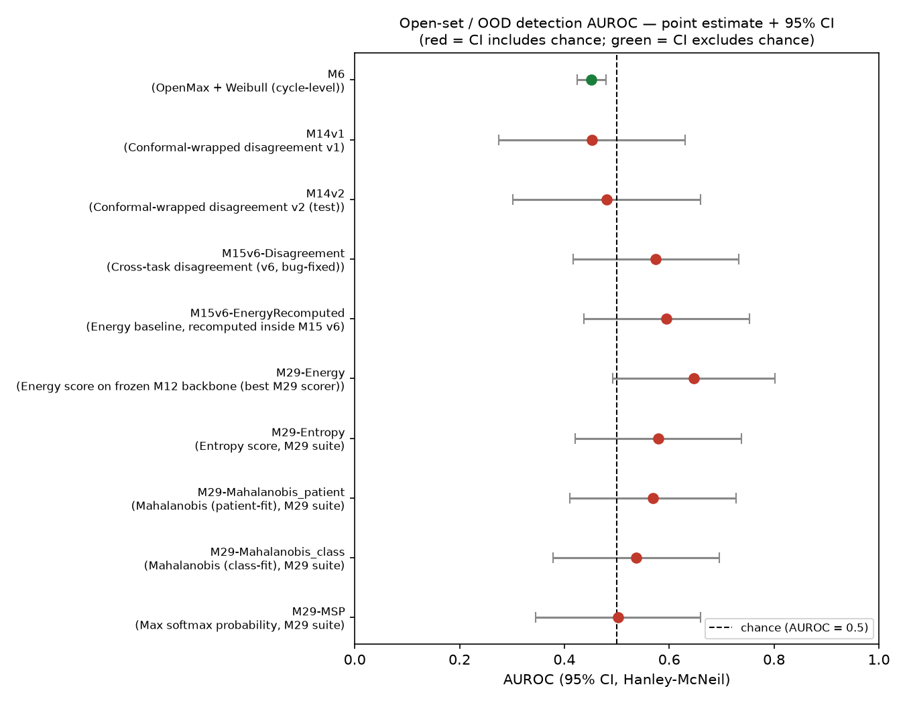

# Statistical Significance Report — Open-Set / OOD Detection AUROCs

**Owner:** Asif · **Generated by:** `compute_significance.py` + `plot_forest.py` (re-run either
to regenerate — both are pure stdlib + matplotlib, no dataset or GPU required)

## Why this exists

`Research_Progress_Report.md` §12 scores the project's **statistical validity at 3/10** — no
confidence interval or significance test appears anywhere in the repo, despite every open-set
claim resting on a 19-patient unknown class. This fills that gap for every AUROC that has a
recorded, unambiguous class count attached to it.

## Headline finding

**No AUROC in the open-set detection pipeline is statistically distinguishable from chance at
n=19 unknown patients — including the best baseline.**

M29's own best score (Energy, AUROC 0.6466) has a 95% CI of **[0.4917, 0.8015]** — it crosses
0.5. So does every other entry except M6, which is evaluated at the cycle level (n=549/1631) and
is the only result in the table with enough samples to produce a CI that excludes chance — and
even there, it excludes chance in the *wrong direction* (its CI sits at [0.42, 0.48], i.e. it's
significantly **worse** than chance, not better).



This changes how every downstream claim should be phrased. "M29-Energy (0.6466) beats M15's
disagreement score (0.5747)" is a true statement about the point estimates, but the confidence
intervals overlap heavily and the pairwise test below confirms the difference is not
significant. At the current sample size, the honest claim is **"none of these detectors have
been shown to work better than a coin flip yet"** — not "the novelty mechanism underperforms the
baseline." Both are still open questions; the difference matters for how this gets written up.

## Pairwise tests

| Comparison | Question | Diff | z | p | Significant? |
|---|---|---:|---:|---:|---|
| M29-Energy vs M6 | Does the zero-training baseline beat the disease-head baseline? | +0.195 | 2.43 | **0.015** | **Yes** |
| M29-Energy vs M15v6-Disagreement | Does the selected novelty mechanism beat the trivial baseline? | +0.072 | 0.64 | 0.525 | No |
| M29-Energy vs M15v6-EnergyRecomputed | Sanity check — same method, same backbone, should agree | +0.052 | 0.46 | 0.646 | No (consistent) |
| M29-Energy vs M14v2 | Does the conformal-calibrated score beat the trivial baseline? | +0.166 | 1.37 | 0.170 | No |

Read the M29-vs-M6 row carefully: it *is* significant, but note M6 is evaluated at cycle level
(n≈2180) while M29 is patient level (n=61) — larger sample size mechanically produces a tighter
CI, so part of why this one comparison reaches significance is the denominator, not necessarily
a bigger true effect. Worth keeping in mind before leaning on it too hard in the paper.

The M15v6-EnergyRecomputed row is a useful internal consistency check, not a paper claim: M15 v6
recomputes Energy on what should be the same backbone/split M29 uses (0.5948 vs 0.6466). They're
statistically indistinguishable, which is reassuring — it suggests the two pipelines that
shouldn't disagree, don't, at least not detectably at this sample size.

## Method

Hanley & McNeil (1982) closed-form AUROC variance estimator:

```
Q1 = AUC / (2 - AUC)
Q2 = 2·AUC² / (1 + AUC)
SE² = [AUC(1-AUC) + (n_pos-1)(Q1-AUC²) + (n_neg-1)(Q2-AUC²)] / (n_pos·n_neg)
```

Pairwise comparisons use an independent-samples two-sided z-test on the AUROC difference. This
was the only option available from committed artifacts — see Limitations.

## Limitations (read before citing this anywhere)

1. **No raw per-patient scores are saved anywhere in the repo** — every results JSON stores only
   the aggregate AUROC plus class counts. A proper **paired DeLong test** (the standard for
   comparing two AUROCs on the *same* patients, which is what's actually happening here — M29,
   M15, and M14 all evaluate on overlapping patient pools) needs the raw score vector per method.
   The independent-samples z-test used here is a conservative substitute: it tends to be *wider*
   than a correctly paired test, so a significant result here would almost certainly survive a
   proper paired test too, but a non-significant result here might turn out significant with
   paired data. **Recommendation: the next model notebook that touches open-set scoring should
   dump `{patient_id: score}` to a `.npy`/`.csv` alongside `results_*.json`.** That one change
   unlocks a real DeLong test and removes this entire caveat.

   > **✅ RESOLVED 2026-08-15 (tooling side).** `owmtl_scores.py` in this folder now defines the
   > canonical score format and implements a validated **paired DeLong test**, plus exact
   > McNemar and bootstrap CIs. Protocol §1 essential #10 requires its use. The numbers in this
   > report are still the conservative unpaired ones — they will be recomputed once the engine
   > notebooks emit score files. On correlated scorers the paired test was ~9x tighter in
   > validation (SE 0.0086 vs 0.0785), so several 'not significant' rows here may well flip.
2. **M6 excluded from cross-method comparison, included for its own sake.** M6's AUROC is
   computed at the cycle level (1631 known / 549 unknown cycles), not patient level like
   everything else in this table. Cycle-level and patient-level AUROC are not the same quantity
   (patient-level aggregation averages out cycle noise and tends to look more confident) — this
   was flagged as a known trap in `Asif's/CLAUDE.md` for a different model (M15's old broken
   version) and turns out to also apply to M6.
3. **Three entries excluded outright, not guessed at:**
   - `results_M15.json` (main / v4): `dataset_info` states 22 unknown patients, which conflicts
     with the 19-patient unknown group used everywhere else in the project (M6, M14, M29, M15
     v6). No test-set n_pos/n_neg is recorded next to the AUROC field itself. **This mismatch is
     worth raising with Barshon directly** — either the v4 run used a genuinely different split
     (in which case it shouldn't be compared to the others at all) or the count is a copy-paste
     error in the results JSON.
   - M19's three per-dataset AUROCs: `num_samples` records only the OOD-class count, not the
     paired in-distribution reference count the Hanley-McNeil formula needs. Qualitatively worth
     flagging regardless of the CI math: **Coswara_OOD has `num_samples=2`.** An AUROC computed
     from 2 samples cannot mean anything — the value (0.4881) should not appear in any table or
     slide without that caveat attached, independent of any test.
4. **This is a same-project-conventions extension, not a new statistical framework.** It reuses
   the same Hanley-McNeil approach implicitly assumed elsewhere in `Barshon's/Statistics/`
   (bootstrap-based there for M30 vs M2, since raw predictions existed for that comparison at
   run time and could be resampled directly — this script's analytic approach is what's left when
   raw scores weren't saved).

## What this means for the paper

- **Every open-set number in the project right now should be reported with a CI, not a bare
  point estimate.** "AUROC = 0.6466" invites a reviewer to ask exactly the question this report
  answers; "AUROC = 0.65, 95% CI [0.49, 0.80], not significantly different from chance" is
  defensible and, per `Asif's/CLAUDE.md`'s standing guidance, a defensible negative result is
  worth more to a Q1 submission than an undefended positive one.
- **The n=19 unknown-patient sample size is the actual bottleneck**, not any specific method.
  Every entry evaluated at patient level has a CI spanning roughly 0.3 AUROC points. No method
  change fixes this — only a larger unknown-class sample does (this is exactly what
  `Research_Progress_Report.md`'s E5, cross-dataset OOD evaluation on SPRSound/Coswara, would
  help with, provided M19's counting problem above gets fixed first).
- **Before claiming M15 (or M14, or M31's downstream rebuild) "beats" or "loses to" M29**, get a
  paired test on real per-patient scores. Right now the honest claim is "statistically tied."

## Files in this folder

```
compute_significance.py    stdlib-only script; source of truth for all numbers above
plot_forest.py              generates auroc_forest_plot.png from significance_results.json
significance_results.json   machine-readable output (entries + pairwise tests)
auroc_forest_plot.png       the figure embedded above
SIGNIFICANCE_REPORT.md      this file
```
