# OWMTL — Merged Decision Roadmap (Path A + Path B, one engine)

> ## 🔴 SUPERSEDED IN PART — Gate G2 failed (2026-08-16)
>
> G2 was run twice and failed both times (crackle AUROC 0.5506 → 0.5580; wheeze 0.5729 → 0.5340,
> against a 0.65 threshold). The project has taken **G2's "if not satisfied (b)" branch**: the
> reliability/evaluation paper, which does not depend on a working bottleneck.
>
> **G3 is never reached** — it presupposed a working concept bottleneck. G4 already failed (only
> 3/126 patients span devices). G5–G7 are superseded by the reframe.
>
> The gate definitions below remain accurate and worth reading; the *forward plan* does not.
> Current direction: [`DECISION_2026-08-16_PIVOT.md`](DECISION_2026-08-16_PIVOT.md) and
> [`PAPER_OUTLINE.md`](PAPER_OUTLINE.md).

---

**For:** Barshon Basak · CSE465 Capstone, NSU · Supervisor: Dr. Khan
**Prepared:** 2026-08-14
**Purpose:** Merge the two directions we compared (Path A = constructive interpretable-bottleneck; Path B = faithfulness/robustness audit) into **one** decision-based plan. This is a roadmap, not a linear script: at each gate you check evidence and branch. The two directions are the *same engine* — the gates decide where the headline points and what venue you land.

---

## The corrected mental model (read first)

- **One shared engine, built first.** Physics/DSP concept extractors → strict concept bottleneck → leakage measurement → concept-space OOD. Both A and B need all of it.
- **The A-vs-B choice is a single, *downstream*, *data-driven* fork** (Gate G3), not an upstream preference and not "the whole decision hall."
- **Most gates are joint** — they say go/no-go on the shared engine and affect A and B identically. Only G3 chooses the headline.
- **You always write one paper with one headline;** the losing framing becomes a supporting section. You never build two projects.
- **Annotation (G0) is orthogonal** — it raises the ceiling of whichever headline wins; it does not choose A or B.

---

## Decision flow (at a glance)

```mermaid
flowchart TD
  G0{"G0 · Annotate a fine-grained<br/>concept subset? (with Dr. Khan)"}
  G0 -->|Yes| ANN["Q1-ceiling track:<br/>begin labeling in wks 1-2"]
  G0 -->|No / defer| G1
  ANN --> G1

  G1{"G1 · Pre-code kill-search<br/>still open?"}
  G1 -->|Twin found| PIVOT1["Narrow to the still-open<br/>sub-question (leakage /<br/>intervention) or reliability-only"]
  G1 -->|Open| BUILD["Build shared engine:<br/>DSP concept extractors"]
  PIVOT1 --> BUILD

  BUILD --> G2{"G2 · Concept extractors valid<br/>vs ICBHI cycle labels?"}
  G2 -->|No| LEAN["Fallback: minimal reliable<br/>concept set (PAPR / flatness /<br/>wheeze band) OR reliability-only paper"]
  G2 -->|Yes| TRAIN["Train CBM variants +<br/>leaky-joint + opaque controls"]
  LEAN --> TRAIN

  TRAIN --> G3{"G3 · DECISION HALL<br/>tradeoff + leakage + intervention"}
  G3 -->|"Bottleneck accurate<br/>+ intervention helps"| PA["HEADLINE = Path A<br/>interpretable, correctable dx"]
  G3 -->|"Collapse / heavy leakage /<br/>weak intervention"| PB["HEADLINE = Path B<br/>faithfulness / robustness audit"]

  PA --> DOWN["Shared downstream:<br/>concept-space OOD, shift,<br/>honest operating point"]
  PB --> DOWN

  DOWN --> G4{"G4 · Device separable?<br/>check_device_structure.py"}
  G4 -->|Yes| DEV["+ leave-one-device-out<br/>covariate stress"]
  G4 -->|No| PED["Rely on pediatric<br/>(SPRSound) shift only"]

  DEV --> G5{"G5 · FM compute committed?"}
  PED --> G5
  G5 -->|Yes| FM["+ FM probing:<br/>do OPERA/M2D listen?"]
  G5 -->|No| NOFM["OPERA as cited baseline only"]

  FM --> G6{"G6 · Findings cohere<br/>into ONE claim?"}
  NOFM --> G6
  G6 -->|No| SHARP["Sharpen to the single<br/>strongest finding"]
  G6 -->|Yes| WRITE["Write the paper<br/>(one headline + support)"]
  SHARP --> WRITE

  WRITE --> G7{"G7 · Venue<br/>(given result + G0)"}
  G7 -->|Annotated + strong| Q1["Q1 journal<br/>(dataset+method or eval-first)"]
  G7 -->|Sharp, no annotation| DOMAIN["Strong domain venue /<br/>borderline Q1"]
  G7 -->|Modest| Q2["Q2 / domain conference"]
```

---

## The gates in detail

Each gate answers your seven questions: **Check · Target · If satisfied · If not satisfied · Next gate · Plans affected · Evidence needed.**

### G0 — Annotation decision *(strategic; make it with Dr. Khan, up front)*
- **What to decide:** Will the team hand-label a small, fine-grained acoustic-concept subset of ICBHI (fine/coarse crackle, inspiratory phase, wheeze pitch) against a clinical reference?
- **Target outcome:** A yes/no the team can actually staff. "Yes" means even ~150–300 cycles with DSP pre-labeling to cut effort.
- **If satisfied (Yes):** Start labeling in weeks 1–2 in parallel with engine-build; you are on the **Q1-ceiling track** — the annotated subset becomes a released asset ("first fine-grained concept annotations for ICBHI") that lifts *either* headline to Q1.
- **If not satisfied (No / defer):** Proceed label-free; ceiling becomes "strong domain venue / borderline Q1." You can still revisit this at G6 if results are strong and you want the Q1 upgrade.
- **Next gate:** G1.
- **Plans affected:** **Both** (orthogonal ceiling lever, not an A/B choice).
- **Evidence needed:** team capacity, access to a clinician/reference for label validation, time budget.

### G1 — Pre-code kill-search *(the M15/Direction-1 lesson; do NOT skip)*
- **What to check:** Re-run the kill-queries before writing engine code — `physics-derived acoustic concept bottleneck respiratory/lung sound`, `label-free signal-based interpretable concept diagnosis auscultation 2026`, `faithfulness/leakage audit respiratory sound model`.
- **Target outcome:** No close twin published since our 2026-08 pass.
- **If satisfied (still open):** Build the shared engine.
- **If not satisfied (twin found):** Don't abandon — **narrow**. If someone published the physics-concept CBM, the *leakage + intervention* sub-questions likely survive; if someone published the faithfulness audit, pivot to the *reliability-under-shift* paper (I5+I6), which needs no clean bottleneck. Only fully stop if *all* sub-questions are taken (unlikely).
- **Next gate:** G2.
- **Plans affected:** **Both.**
- **Evidence needed:** a fresh literature search (30–60 min); log the queries + dates.

### G2 — Concept-extractor validity *(the make-or-break technical gate)*
- **What to check:** Do the DSP concept extractors reproduce ICBHI's *coarse* labels (crackle/wheeze presence) at a sane rate, and are the *clinically-named physics* concepts (fine/coarse crackle via duration+center-freq, breathing phase, wheeze pitch band, rhonchi, flatness, PAPR) reliably computable per cycle? *(Refinement 1: these must be clinically-named adventitious-sound concepts in a strict bottleneck — not a generic MFCC/spectral-centroid branch, which is already published.)*
- **Target outcome:** Extractors agree with cycle labels above a defensible floor (e.g., crackle/wheeze detection materially better than chance; phase detector visually sane on spot checks).
- **If satisfied:** Proceed to train the bottleneck variants — the full plan is live.
- **If not satisfied:** **Fall back gracefully.** Either (a) shrink to the *minimal reliable* concept set you already trust (M35's PAPR/spectral-flatness + a wheeze-band feature) and proceed with a thinner bottleneck, or (b) if extraction is hopeless, pivot to the **reliability-only paper** (I5 physics-fragility + I6 operating point + optional FM probing) which does not depend on clean concepts. This is your insurance against the §2.5 validity hole appearing at the *feature* level.
- **Next gate:** G3.
- **Plans affected:** **Both** (it's the shared foundation). A total failure here pushes you toward Path B-lite by necessity.
- **Evidence needed:** extractor-vs-label agreement tables; visual QC of phase/crackle detection on sample cycles; comparison against the published breathing-phase detector (arXiv:1903.10251) as a sanity reference.

### G3 — **THE DECISION HALL** *(the one true A-vs-B fork; data-driven, never a priori)*
- **What to decide:** Which headline is honest — read three numbers you now have: (1) the accuracy–interpretability tradeoff (strict bottleneck vs opaque baseline, per-class disease F1, does it collapse toward COPD?); (2) concept leakage (does the model bypass the bottleneck?); (3) intervention effect (does correcting a concept measurably change/fix the diagnosis?).
- **Target outcome:** A clear read on whether the bottleneck *works as a diagnosis* or *fails informatively*.
- **If satisfied for Path A** (bottleneck accuracy clinically acceptable **and** intervention measurably helps **and** leakage is low): **Headline = Path A** — "an interpretable-by-design, clinician-correctable respiratory diagnosis." Leakage/OOD/shift become supporting sections.
- **If satisfied for Path B** (bottleneck costs large accuracy / collapses to COPD / leaks heavily / intervention weak): **Headline = Path B** — "physics-concept bottleneck shows models don't route through the clinical concepts; here is the faithfulness + robustness audit." The (weak) intervention result becomes supporting evidence, not a failure.
- **If genuinely ambiguous** (middling on all three): default to **Path B** — it's the lower-risk headline because it doesn't require winning on accuracy — and keep Path A's demo as support.
- **Next gate:** G4 (downstream is shared regardless of which headline won).
- **Plans affected:** **This is the only gate that chooses A vs B.** Everything up- and downstream is shared.
- **Evidence needed:** tradeoff curve with CIs; per-class disease F1 (watch COPD dominance); information-theoretic leakage estimate per variant (indep/sequential/leaky); intervention Δaccuracy per corrected concept.

### G4 — Device-structure feasibility *(cheap; run it early even though it only matters here)*
- **What to check:** Do patients span multiple of ICBHI's 4 devices, or is device confounded with diagnosis? Run `Asif's/audit/check_device_structure.py`.
- **Target outcome:** Device is separable from patient/diagnosis enough to support leave-one-device-out.
- **If satisfied:** Add the leave-one-device-out covariate-shift analysis (strengthens the robustness section for either headline).
- **If not satisfied:** Drop the device axis (as the Direction-1 post-mortem warned — only 4 devices, possible confound) and rely on **pediatric (SPRSound) shift** as your covariate stress. Say so explicitly in the paper.
- **Next gate:** G5.
- **Plans affected:** **Both** (a shared evaluation component; matters slightly more to Path B's robustness claim).
- **Evidence needed:** the audit script's output (device count, device–diagnosis confounding, per-patient device spread).

### G5 — Foundation-model probing go/no-go *(you have the compute; decide if it's worth it)*
- **What to decide:** Integrate an OPERA/M2D embedding and probe whether it encodes the physics concepts and stays faithful under shift (I3)?
- **Target outcome:** A tractable integration that yields an interesting result either way ("FMs do/don't listen").
- **If satisfied (worth it):** Add the "do foundation models listen?" section — closes your deferred Attack 7 and raises the ceiling, **especially for Path B**.
- **If not satisfied (integration too costly / null / time-short):** Drop it; cite OPERA/M2D/HeAR as baselines only. The paper still stands on the CNN-scale engine.
- **Next gate:** G6.
- **Plans affected:** **Mainly Path B** (raises its ceiling); optional enrichment for Path A.
- **Evidence needed:** probing accuracy of concepts from the FM embedding; faithfulness/calibration under device + pediatric shift; an honest read on integration effort vs weeks remaining.

### G6 — Result-sharpness / "so what?" *(the convergence gate; protects Path B from sprawl)*
- **What to check:** Do the findings cohere into **one** crisp, defensible claim supported by 2–3 results with CIs — not a measurement buffet?
- **Target outcome:** A one-sentence headline you could say to a skeptical reviewer.
- **If satisfied:** Write the paper — one headline (A or B), everything else demoted to support.
- **If not satisfied:** **Sharpen.** For Path B, cut to the single strongest finding (usually the physics-fragility-under-pediatric-shift result or the leakage result). For Path A, lean the narrative on the intervention demo. Re-check G0: if the result is strong but venue ceiling is limiting, this is the moment to reconsider annotation.
- **Next gate:** G7.
- **Plans affected:** **Both** (Path B is more at risk of failing this gate — that's its main disadvantage).
- **Evidence needed:** the full results table with CIs; a draft one-sentence contribution statement tested against the Reviewer #2 attacks (report §Step 10).

### G7 — Venue decision *(terminal; the paths converge here, with Dr. Khan)*
- **What to decide:** Where to submit, given final result strength × the G0 annotation decision.
- **Target outcome:** An honest venue, per your "best honest venue" instruction.
- **Branches (convergence):**
  - *Annotated + strong result (A or B):* **Q1** — dataset+method (A) or evaluation-first (B).
  - *No annotation + sharp result:* **strong domain venue / borderline Q1** (BSPC, CBMS, Interspeech, EMBC).
  - *Modest result:* **Q2 / domain conference** (Diagnostics, EMBC) — still an honest, publishable capstone.
- **Plans affected:** **Both converge here.**
- **Evidence needed:** final result strength vs the venue's typical bar; Dr. Khan's read on Q1 necessity.

---

## How the branches converge, terminate, or diverge

- **Convergence:** After G3 picks a headline, **A and B run the identical downstream** (G4–G6) and converge again at the venue gate G7. There is only ever one paper.
- **Graceful degradation (never a dead end):** G1 twin → narrow; G2 extractor failure → reliability-only paper; G3 collapse → that *is* Path B; G5 FM too costly → drop it. Every "no" branch lands on a still-publishable paper, not a cliff.
- **Divergence points (only three real forks):** G3 (headline A vs B), G0 (Q1-ceiling vs domain-ceiling), and the G7 venue split. Everything else is joint go/no-go.
- **The §7 rock still binds:** none of these branches beats ICBHI's structural ceiling by accuracy. G0 (annotation) is the only lever that lifts the ceiling; G3→B is the framing that makes the ceiling irrelevant to success.

---

## Cross-validation log (2026-08-14) — adversarial "find the killer" pass

Before committing, I re-ran a full kill-search targeting *each pillar* of this plan and read the two most-threatening papers in full. **Verdict: no conflict — the plan survives, with two refinements.** This is the pass that the earlier failed plans (M15, Direction 1) never got before code was written.

| Pillar of the plan | Closest / newest work found | Conflict? | Label |
|---|---|---|---|
| Physics/DSP **clinically-named concept bottleneck** for respiratory | Two "explainable multi-modal" papers (MDPI *Life* 16071108; arXiv:2512.00563) use **generic DSP features (MFCC/ZCR/spectral centroid) as a parallel branch + post-hoc Grad-CAM/SHAP** — *not* a strict bottleneck, *not* clinically-named concepts | **No** — neighbors, not twins | **[Plausible] open** |
| **Faithfulness / leakage** audit for auscultation | arXiv:2512.00563 literally claims "attributions in the 300–1500 Hz range" **without verifying the model uses them**; HearSay (2601.03783) & audio-LLM shortcut audits (2607.13477) are non-respiratory | **No — it *motivates* Path B** | **[Plausible] open** |
| Domain-shift + explainability respiratory | MDPI *Life* 16071108 does domain-shift eval + post-hoc XAI, **closed-set, no bottleneck, no faithfulness, no OOD** | **No** — cite & differentiate | Neighbor |
| **FM concept-probing** ("do FMs listen?") | Cough *regression* benchmark (2606.15436); OPERA (2406.16148) — no faithfulness probing | **No** | **[Plausible] open** |
| **Pediatric-physics-fragility** | Pediatric lung-sound model (2023); frequency-selection (2507.20052) — none claims adult priors fail via frequency scaling | **No** | **[Plausible] open** |
| **Concept-space OOD** for respiratory | Audio→concept representations (2504.14076, general audio); voice CBM (2607.16967) | **No** | **[Plausible] open** |
| **Concept intervention** on lung sound | Web-Conf-2026 interactive explainable *medical* diagnosis (not audio) | **No** | **[Plausible] open** |
| Respiratory concept bottleneck (bare) | Still none; only prototype learning (2110.03536, post-hoc, 2021) | **No** | **[Plausible] open** |

**Refinement 1 (bake into G2/G3):** the concept layer must use **clinically-named adventitious-sound concepts** (fine/coarse crackle, wheeze pitch band, inspiratory phase, rhonchi) enforced as a **strict bottleneck** — *not* a parallel branch of generic MFCC/spectral features. That generic-DSP-branch design is now clearly done (the two *Life*/arXiv papers above), so the distinctness of this plan lives specifically in "clinically-named + strict bottleneck + faithfulness-measured."

**Refinement 2 (framing for Path B):** cite arXiv:2512.00563 and MDPI *Life* 16071108 as **motivation**, not competition — "recent respiratory papers *assert* the model attends to acoustic biomarkers but never verify it; we build the audit that does." This turns the two nearest neighbors into your setup paragraph.

**Reinforced caveat (Step 13 stands):** the "explainable respiratory + domain shift" space and the "audit whether audio models take shortcuts" genre are both visibly more active in 2026. Neither is your exact intersection, but it means **Path B's framing must stay sharply respiratory-and-concept-specific** — a generic "we audited a model" would now get lost. Re-run this kill-search once more right before submission.

**Net effect on the roadmap:** unchanged. All 8 gates stand; only the concept-vocabulary definition (G2) and the Path-B intro framing (G6/write) are sharpened.

---

## What this roadmap is NOT (scope guard)

It is a *decision graph*, not the build schedule. The next deliverable — the **week-by-week build sheet** — will map weeks 1–9 onto BUILD → G2 → TRAIN → G3 → downstream, name the exact experiments, and state which existing models (M2, M35, M29, M13, M14/M20, M7, device labels, Coswara/SPRSound) feed each step, with G3 as the explicit mid-project decision gate. Say the word and I'll generate it against this graph.
